# Guide utilisateur - Process Discovery Assistant

Version du guide : 1.1  
Produit : Process Discovery Assistant  
Public : tenant admin, referent de direction, validateur, consultant, readonly, super admin HiGroup

## Table des matieres

1. [Objectif du produit](#objectif-du-produit)
2. [A propos des captures d'ecran](#a-propos-des-captures-decran)
3. [Roles et permissions](#roles-et-permissions)
4. [Navigation generale](#navigation-generale)
5. [Dashboard tenant](#dashboard-tenant)
6. [Directions](#directions)
7. [Processus](#processus)
8. [Creer un processus](#creer-un-processus)
9. [Wizard de formalisation](#wizard-de-formalisation)
10. [Atelier de formalisation](#atelier-de-formalisation)
11. [RACI](#raci)
12. [BPMN](#bpmn)
13. [Procedure qualite](#procedure-qualite)
14. [Copilote IA](#copilote-ia)
15. [Conformite Maroc](#conformite-maroc)
16. [Process Mining](#process-mining)
17. [Exports officiels](#exports-officiels)
18. [Notifications](#notifications)
19. [Mes actions](#mes-actions)
20. [Audit](#audit)
21. [Administration HiGroup](#administration-higroup)
22. [Parcours utilisateurs](#parcours-utilisateurs)
23. [Depannage](#depannage)
24. [Checklist avant publication](#checklist-avant-publication)

## Objectif du produit

Process Discovery Assistant aide une organisation a cartographier, documenter, controler et publier ses processus metier. L'application centralise les directions, processus, activites, responsabilites RACI, modeles BPMN, procedures qualite, conformite Maroc, exports officiels, notifications, actions et audit.

Le parcours standard est le suivant :

1. Creer ou ouvrir un processus.
2. Completer le wizard de formalisation.
3. Controler la qualite dans l'atelier.
4. Generer RACI, BPMN et procedure.
5. Soumettre, corriger, valider ou publier selon le workflow.
6. Produire les exports officiels et suivre les actions.

## A propos des captures d'ecran

Les captures sont fournies a titre illustratif. Les libelles et donnees affiches peuvent varier selon le tenant, le role et les permissions.

Les captures de ce guide sont issues de l'application locale en mode demonstration. Elles ne contiennent pas de secret, token, mot de passe, cle API ou donnee sensible reelle.

## Roles et permissions

| Role | Usage principal |
| --- | --- |
| `super_admin` | Administration plateforme HiGroup, tenants, support et supervision SaaS. |
| `tenant_admin` | Pilotage complet du tenant, directions, processus, exports et audit. |
| `direction_referent` | Formalisation et suivi des processus de son perimetre direction. |
| `validator` | Revue, demande de correction, approbation et validation. |
| `consultant` | Contribution encadree selon les permissions accordees. |
| `readonly` | Consultation sans modification. |

Si une page affiche un refus d'acces ou si un bouton est desactive, verifier le role, le tenant actif, le perimetre direction et le statut du processus.

## Navigation generale

La barre laterale permet d'acceder aux espaces principaux :

- Dashboard
- Directions
- Processus
- Exports
- Notifications
- Mes actions
- Activite
- Audit
- Admin HiGroup

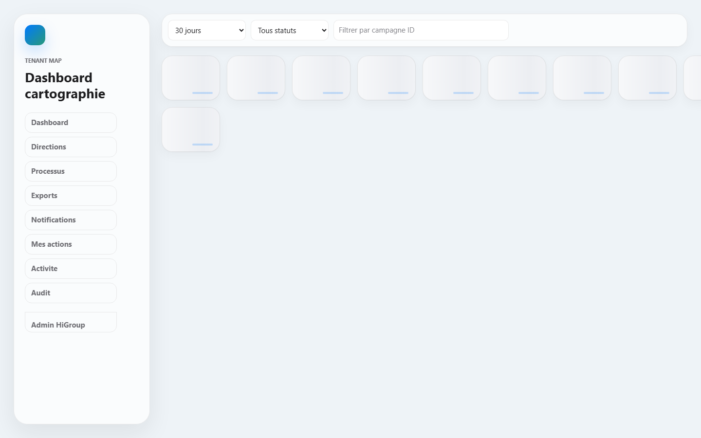

Conseils :

- Demarrer par le dashboard pour lire l'avancement global.
- Utiliser les pages Directions et Processus pour agir sur le perimetre operationnel.
- Ouvrir l'atelier lorsqu'un processus necessite une analyse complete.

## Dashboard tenant

Objectif utilisateur : piloter la cartographie du tenant et identifier les priorites.

Le dashboard presente notamment :

- directions et processus couverts ;
- statuts des processus ;
- score moyen de completude ;
- validations en attente ;
- risques critiques ;
- opportunites d'automatisation ;
- actions prioritaires.

Actions principales :

- filtrer par periode ;
- filtrer par statut ;
- reperer les directions en retard ;
- ouvrir les processus a corriger ou a valider.

Erreur frequente : confondre un indicateur de completude avec une validation officielle. La validation depend du workflow et des droits.

## Directions

Objectif utilisateur : gerer la couverture organisationnelle et les referents.

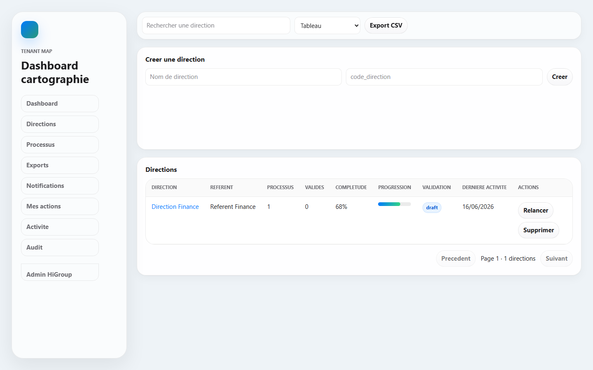

Actions principales :

- creer une direction ;
- basculer entre vue tableau et vue cartes ;
- exporter la liste ;
- ouvrir le detail d'une direction ;
- relancer ou affecter un referent selon les droits.

Conseil : nommer les directions de facon stable, car elles structurent les filtres, les processus et les exports.

## Processus

Objectif utilisateur : rechercher, filtrer et ouvrir les processus du tenant.

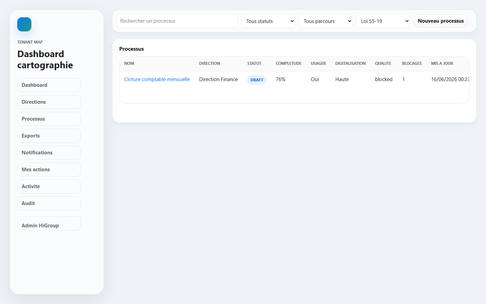

La liste affiche le nom, la direction, le statut, la completude, la qualification usager, la digitalisation, les blocages et les actions rapides.

Actions principales :

- rechercher par nom ;
- filtrer par statut ;
- filtrer les processus usager ou internes ;
- filtrer l'applicabilite Loi 55-19 ;
- ouvrir la fiche, le wizard ou l'atelier ;
- creer un nouveau processus.

Erreur frequente : modifier un processus sans verifier son statut. Certains statuts imposent une correction, une validation ou une nouvelle version.

## Creer un processus

Objectif utilisateur : initier un brouillon structure.

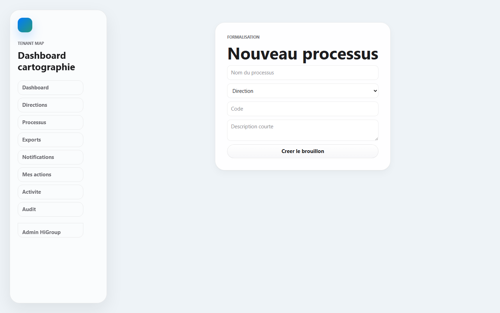

Champs principaux :

- nom du processus ;
- direction ;
- code optionnel ;
- description.

Le nom et la direction sont obligatoires. Apres creation, l'utilisateur poursuit la formalisation dans le wizard.

Conseil : choisir un nom actionnable, par exemple "Cloture comptable mensuelle" plutot qu'un nom trop general.

## Wizard de formalisation

Objectif utilisateur : saisir les informations necessaires de maniere guidee.

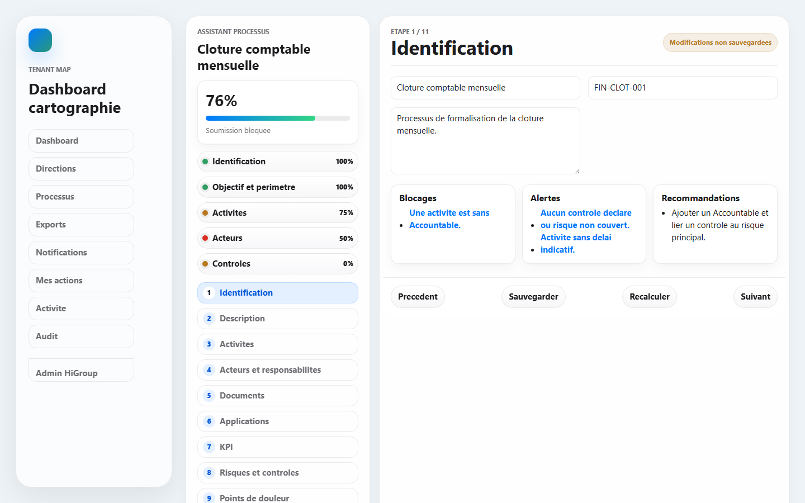

Le wizard couvre les sections suivantes :

1. Identification
2. Description
3. Activites
4. Acteurs et responsabilites
5. Documents
6. Applications
7. KPI
8. Risques et controles
9. Points de douleur
10. Besoins d'automatisation
11. Resume et soumission

Actions principales :

- completer les champs etapes par etapes ;
- sauvegarder regulierement ;
- surveiller la completude ;
- corriger les warnings ;
- soumettre quand les conditions sont remplies.

Erreur frequente : soumettre trop tot. Une completude insuffisante ou des blocages qualite peuvent empecher la soumission.

## Atelier de formalisation

Objectif utilisateur : analyser, controler et finaliser un processus.

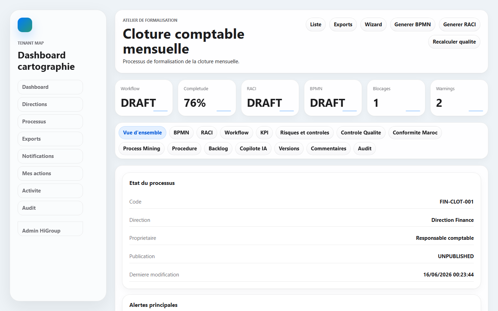

L'atelier regroupe les vues suivantes :

- vue d'ensemble ;
- BPMN ;
- RACI ;
- workflow ;
- KPI ;
- risques et controles ;
- controle qualite ;
- conformite Maroc ;
- process mining ;
- procedure ;
- backlog ;
- versions ;
- commentaires ;
- audit ;
- copilote IA si active.

Actions principales :

- lire les blocages et recommandations ;
- ouvrir le wizard pour corriger ;
- generer RACI et BPMN ;
- preparer la procedure ;
- suivre commentaires, versions et audit.

## RACI

Objectif utilisateur : clarifier les responsabilites par activite.

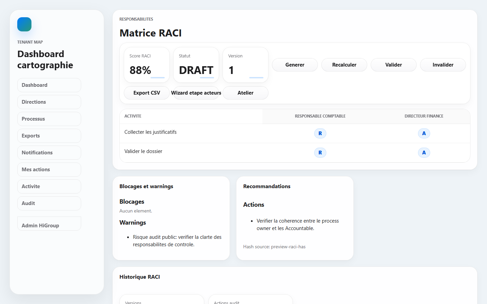

Signification :

- `R` : Responsible, realise l'activite.
- `A` : Accountable, porte la responsabilite finale.
- `C` : Consulted, apporte un avis.
- `I` : Informed, est informe.

Points de controle :

- chaque activite doit avoir au moins un responsable ;
- chaque activite doit avoir un accountable clair ;
- plusieurs accountable sur une meme activite peuvent generer un warning ;
- la validation depend des droits utilisateur.

## BPMN

Objectif utilisateur : visualiser et exporter le flux du processus.

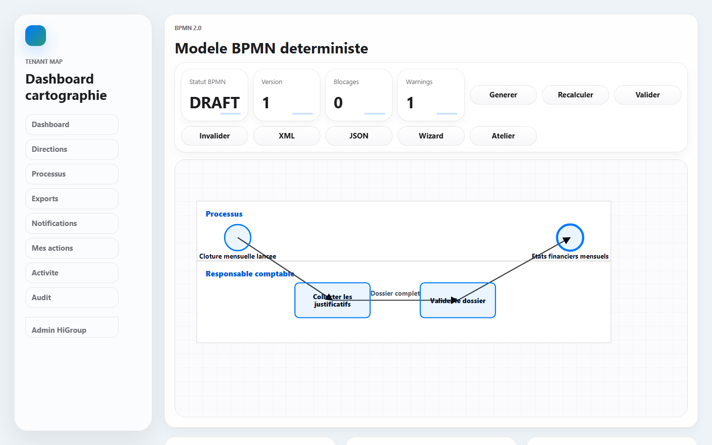

Actions principales :

- generer ou recalculer le BPMN ;
- verifier les lanes, evenements, taches et transitions ;
- valider ou invalider selon les droits ;
- exporter le XML BPMN pour un outil compatible ;
- exporter le JSON si necessaire.

Conseil : verifier le BPMN avec les acteurs metier avant publication.

## Procedure qualite

Objectif utilisateur : produire un document qualite exploitable.

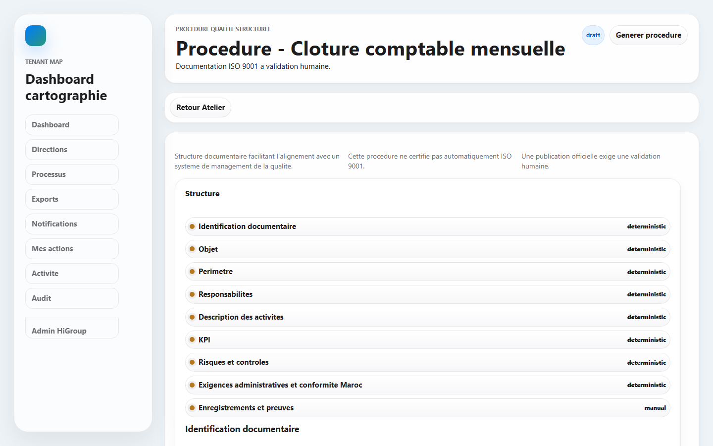

Sections typiques :

- identification ;
- objet ;
- perimetre ;
- responsabilites ;
- entrees et sorties ;
- activites ;
- documents ;
- applications ;
- KPI ;
- risques et controles ;
- conformite Maroc ;
- preuves ;
- versions et approbations.

Regle importante : la procedure assiste la formalisation, mais elle ne remplace pas une revue humaine.

## Copilote IA

Objectif utilisateur : obtenir des suggestions a valider humainement.

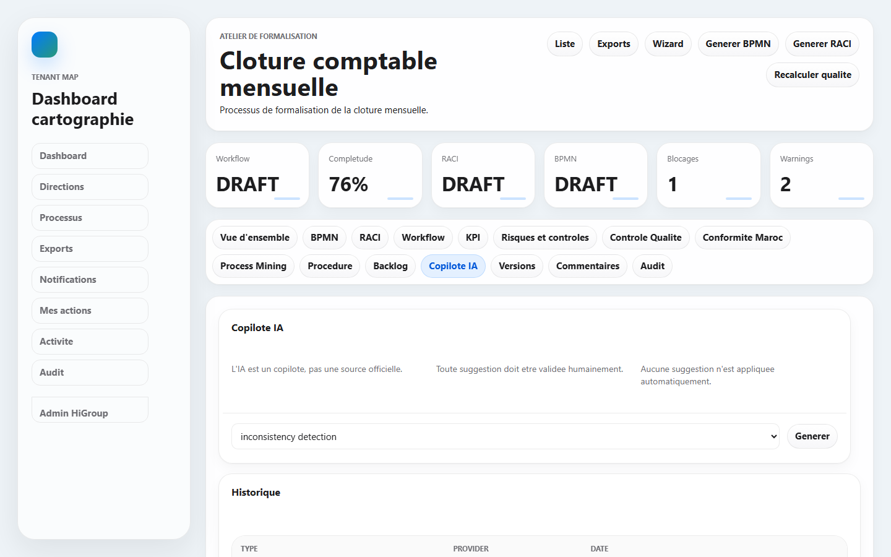

Actions principales :

- choisir un type de suggestion ;
- generer une proposition ;
- accepter, rejeter ou valider selon les droits ;
- transformer une suggestion en KPI, risque, controle, backlog ou procedure si applicable.

Conseil : considerer l'IA comme une aide a la decision, jamais comme une source officielle automatique.

## Conformite Maroc

Objectif utilisateur : suivre les exigences liees aux processus usagers et a la Loi 55-19 lorsque le processus est concerne.

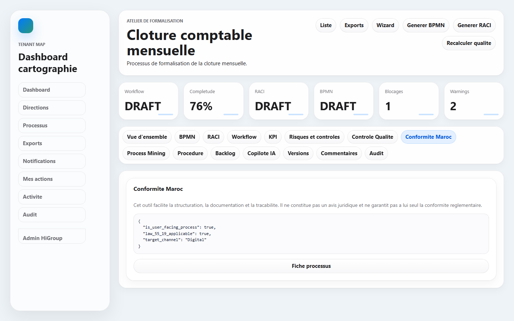

Points de controle :

- qualification processus usager ;
- applicabilite Loi 55-19 ;
- delais cibles ;
- pieces justificatives ;
- preuves et simplification ;
- points de blocage.

Conseil : documenter les preuves et decisions, car elles alimentent les exports et l'audit.

## Process Mining

Objectif utilisateur : exploiter les evenements pour detecter variantes, delais, goulots et opportunites d'automatisation.

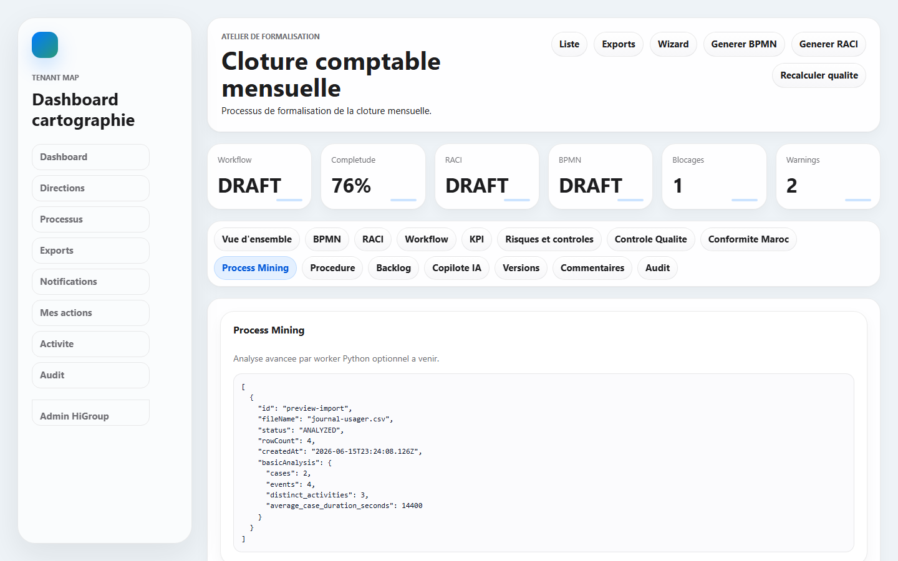

Actions principales :

- importer ou simuler un journal d'evenements ;
- analyser la variante principale ;
- lire les durees moyennes ;
- identifier les goulots ;
- transformer les recommandations en backlog.

Erreur frequente : importer un fichier incomplet. Les colonnes minimales doivent permettre de relier les cas, activites, dates et ressources.

## Exports officiels

Objectif utilisateur : produire les livrables officiels.

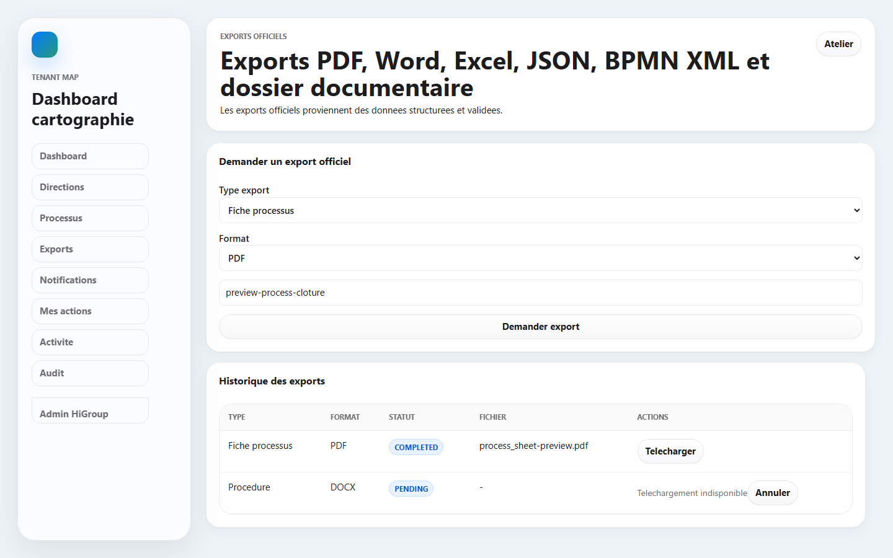

Formats disponibles :

- PDF
- DOCX
- XLSX
- JSON
- BPMN XML
- ZIP

Types d'exports :

- fiche processus ;
- procedure ;
- matrice RACI ;
- diagramme BPMN ;
- registre risques ;
- registre KPI ;
- backlog ;
- synthese direction ;
- synthese executive ;
- conformite Maroc ;
- rapport process mining ;
- extrait audit ;
- dossier documentaire complet.

Parcours export :

1. Choisir le type d'export.
2. Choisir le format.
3. Lancer la generation.
4. Attendre le statut termine.
5. Telecharger le fichier.
6. Verifier l'historique et les notifications.

## Notifications

Objectif utilisateur : suivre les evenements importants.

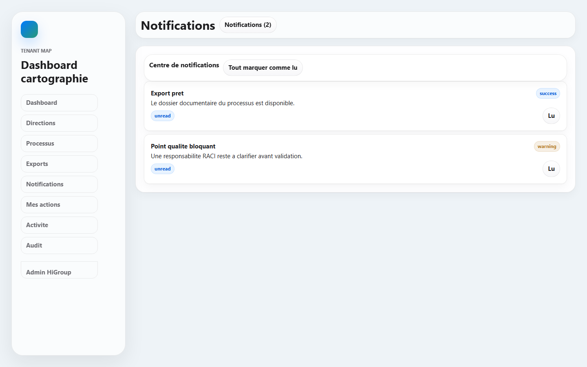

Exemples de notifications :

- export pret ;
- point qualite bloquant ;
- affectation ;
- correction demandee ;
- validation attendue.

Actions principales :

- lire une notification ;
- ouvrir son action associee ;
- marquer comme lue ;
- tout marquer comme lu ;
- ajuster les preferences.

## Mes actions

Objectif utilisateur : retrouver les taches a traiter.

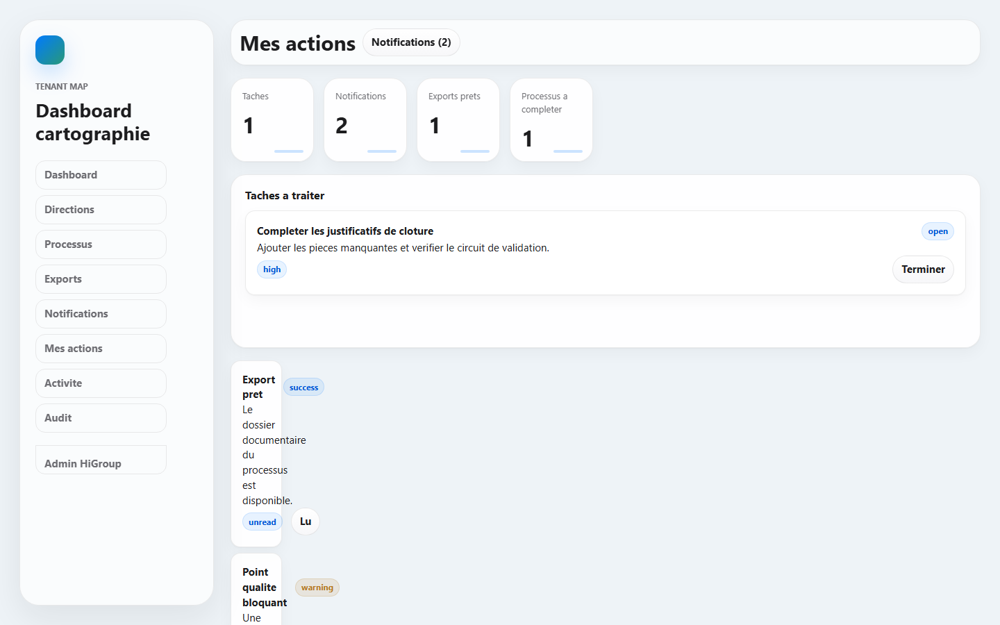

La page consolide :

- taches affectees ;
- notifications importantes ;
- exports prets ;
- processus qui requierent une action.

Conseil : pour un validateur, cette page est le point d'entree le plus efficace avant d'ouvrir l'atelier.

## Audit

Objectif utilisateur : tracer et verifier les actions importantes.

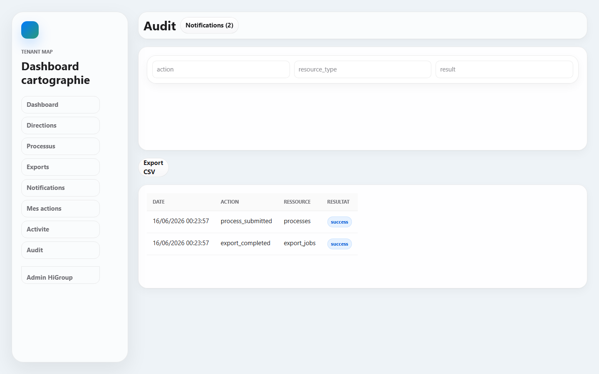

Filtres disponibles :

- action ;
- ressource ;
- resultat.

Regles de securite :

- ne jamais afficher de mot de passe ;
- ne jamais afficher de token ;
- ne jamais afficher de cookie ;
- ne jamais afficher de cle API ;
- ne jamais afficher de chaine de connexion base de donnees ;
- ne jamais afficher de secret de stockage.

## Administration HiGroup

Objectif utilisateur : superviser la plateforme SaaS.

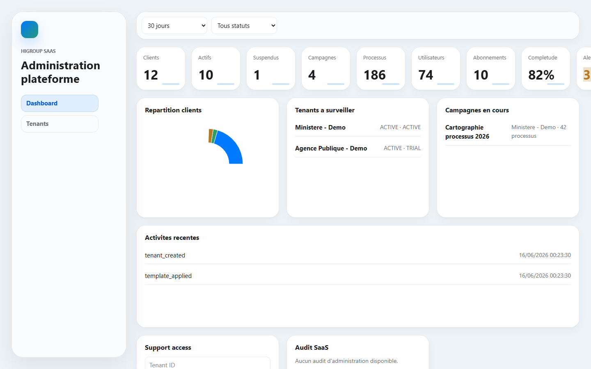

L'espace admin est reserve au role `super_admin`.

Fonctions principales :

- consulter les indicateurs plateforme ;
- suivre les tenants ;
- surveiller les campagnes ;
- gerer les demandes support ;
- consulter l'audit SaaS.

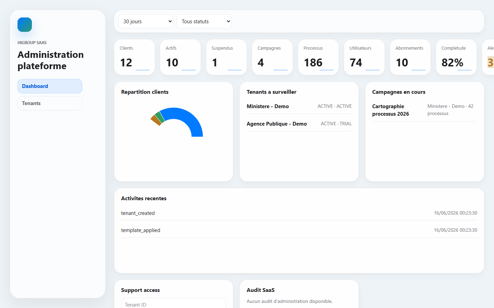

Erreur frequente : tenter d'ouvrir `/admin` avec un role tenant. Dans ce cas, l'acces est refuse.

## Parcours utilisateurs

### Tenant admin

1. Ouvrir le dashboard tenant.
2. Verifier la couverture et les priorites.
3. Controler Directions et Processus.
4. Creer ou ouvrir un processus.
5. Completer le wizard.
6. Ouvrir l'atelier.
7. Generer RACI, BPMN et procedure.
8. Verifier qualite, conformite, risques et KPI.
9. Soumettre ou faire approuver.
10. Generer les exports officiels.
11. Suivre notifications, mes actions et audit.

### Referent de direction

1. Ouvrir les processus de sa direction.
2. Completer les informations manquantes.
3. Corriger les blocages.
4. Repondre aux demandes de correction.
5. Resoumettre au validateur.

### Validateur

1. Ouvrir Mes actions.
2. Examiner les processus soumis.
3. Lire l'atelier, RACI, BPMN et procedure.
4. Demander correction ou approuver.
5. Verifier l'audit.

### Consultant

1. Acceder au perimetre autorise.
2. Contribuer aux donnees de formalisation.
3. Proposer des corrections.
4. Laisser la validation finale aux roles autorises.

### Readonly

1. Consulter les processus autorises.
2. Lire les livrables publies.
3. Telecharger les exports autorises.
4. Ne pas tenter d'action de modification.

### Super admin HiGroup

1. Ouvrir l'espace Admin HiGroup.
2. Surveiller les indicateurs plateforme.
3. Controler les tenants et alertes.
4. Gerer le support selon les procedures internes.
5. Verifier l'audit SaaS.

## Depannage

| Probleme | Cause probable | Solution |
| --- | --- | --- |
| Acces tenant refuse | Tenant non selectionne ou role insuffisant | Verifier le contexte tenant et les droits. |
| Bouton desactive | Permission manquante ou statut incompatible | Verifier le role et l'etat du processus. |
| Soumission refusee | Completude insuffisante ou blocage qualite | Corriger les sections signalees. |
| Export indisponible | Donnees insuffisantes ou generation en cours | Completer le processus ou attendre la fin du job. |
| RACI/BPMN non validable | Blocages restants | Lire les panneaux blocages et warnings. |
| Admin refuse | Role non super admin | Utiliser un compte habilite HiGroup. |

## Checklist avant publication

- Le processus a un nom, une direction et un objectif clair.
- Les activites sont ordonnees et coherentes.
- Les acteurs et responsabilites sont renseignes.
- Le RACI ne contient pas de blocage critique.
- Le BPMN ne contient pas de blocage critique.
- Les KPI principaux sont definis.
- Les risques et controles sont documentes.
- La conformite Maroc est renseignee si applicable.
- La procedure a ete relue humainement.
- Les exports officiels ont ete generes et verifies.
- Les notifications et l'audit confirment les actions importantes.
